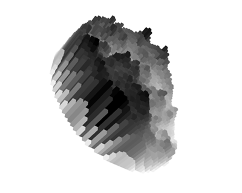

# Pixel Value Visualizer

  

This is repo is the source of [pixel-value.danya.ca](http://pixel-value.danya.ca/).
The site uses threeJS to represent images' pixel values (lightness) in a spatial dimension.
Drag the images to see their flip-sides and reveal their third spatial dimension. 